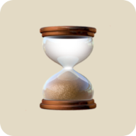

  
  <h3>FlowTimer</h2>
  
Pomodoro Reimagined

  
Instead of restricting yourself to set work intervals, allow yourself to enter the flow state by timing yourself working for as long as you want. Breaks are calculated as a ratio of time worked, being rewarded for working longer!

## ✨ Features
- To-do list to track tasks
- Responsive web design
- Dark/light mode
- Customizable timer settings
- Audio notifications at the end of break timer
- Session stats (coming soon...)
- Browser persisted tasks/stats (coming soon...)
- Login to save tasks/stats (coming soon...)

## 👨🏾‍💻 Tech Stack
- **TypeScript**: Language
- **React**: Web framework
- **Chakra UI**: UI framework

## 🤝 Contributing
Feel free to open an issue with any feature request/bug reports!
