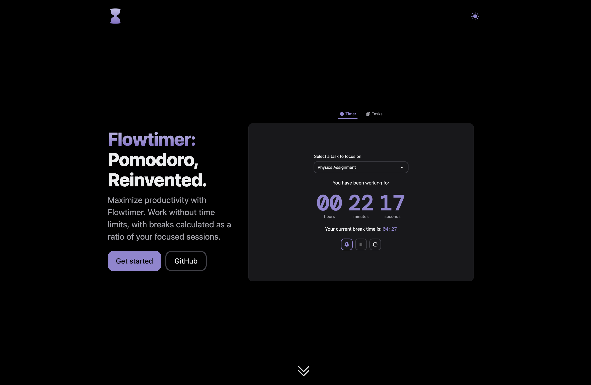

  
  
Pomodoro Reimagined

  
Work without time limits, with breaks calculated as a ratio of your focused sessions.

  
<a href="https://flow-timer.com">Website</a> · <a href="https://ammarahmed.ca">Creator</a>

## ✨ Features
- To-do list to track tasks
- Responsive web design
- Dark/light mode
- Customizable timer settings
- Audio notifications at the end of break timer
- Search and play audio from YouTube videos

## 👨🏾‍💻 Tech Stack
- **TypeScript**: Language
- **React**: Web framework
- **Next UI**: UI framework
- **Vercel**: Deployment

## 🤝 Contributing
Feel free to open an issue with any feature request/bug reports!
